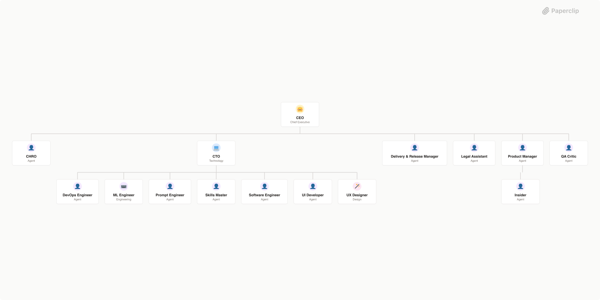

# NPT Software House



AI-powered software development organization building innovative 3D reconstruction and AI-based products with autonomous agent teams.

---

## Phase 1: Pragmatic Structure

**Status:** Ready for Phase 1 execution

### Active Agents (5 core + 1 manual-only)

| Agent | Role | Heartbeat | Purpose |
|-------|------|-----------|---------|
| Software Engineer | Builder | 5 min | Full-stack implementation |
| ML Engineer | Builder | 5 min | AI/ML model integration |
| UI Developer | Builder | 5 min | Frontend & design |
| Tech Lead | Leadership | 10 min | Technical guidance & unblocking |
| Quality Gate | Review | Triggered | Delivery standards enforcement |
| CEO | Executive | Manual | Strategic synthesis (on-demand) |

### Why This Structure?

Initial design: 8-agent autonomous team. Reality: Paperclip sandbox blocks API calls needed for autonomous delegation.

**Solution:** Humans create tasks, agents execute autonomously. Phase 1 ships in 5 days with ~3 hours human overhead.

See [COORDINATION.md](COORDINATION.md) for workflow details.

### Projects

- **3D Civil Works** — Reconstruct 3D models from 2D images of civil structures. Current: MVP with dummy mesh. Phase 1: Integrate real depth estimation + mesh generation.
- **Onboarding** — Internal workflows and documentation (planned)

### Phase 1 Tasks

See [projects/3d-civil-works/.ROADMAP.md](projects/3d-civil-works/.ROADMAP.md) for breakdown:

1. 1.1 - GLB Mesh Format & glTF 2.0 Validation
2. 1.2 - Integrate MiDaS Depth Estimation Model
3. 1.3 - Implement Poisson Mesh Generation
4. 1.4 - Add Celery Async Job Queue
5. 1.5 - Implement SQLite Persistence Layer
6. 1.6 - Add Basic Auth & Rate Limiting
7. 1.7 - Document Deployment & Scaling

---

## Getting Started

### For Developers (Contributors)

1. Read [COORDINATION.md](COORDINATION.md) — understand the workflow
2. Read [projects/3d-civil-works/README.md](projects/3d-civil-works/README.md) — understand the project
3. Check [projects/3d-civil-works/.ROADMAP.md](projects/3d-civil-works/.ROADMAP.md) — see current phase
4. If assigned a task, read the issue description and start building

### For Tech Lead

1. Read [agents/tech-lead/AGENTS.md](agents/tech-lead/AGENTS.md) — understand your role
2. Watch for @mentions from builders in issue comments
3. Post technical guidance within 10 minutes
4. Read [COORDINATION.md](COORDINATION.md) for workflow

### For Quality Gate

1. Read [agents/quality-gate/AGENTS.md](agents/quality-gate/AGENTS.md) — understand your role
2. When a builder marks "ready-for-review", wake up and check the delivery gate
3. Post approval or gaps in comments
4. Max 2 revision cycles per feature

### For Humans (Task Management)

1. Read [COORDINATION.md](COORDINATION.md) — understand the workflow
2. Create Phase 1 tasks in Paperclip UI
3. Assign to appropriate builder (Software Engineer, ML Engineer, UI Developer)
4. Monitor for progress and blockers
5. Unblock if needed
6. Merge approved PRs when all tasks complete

---

## Documentation

| Document | Purpose |
|----------|---------|
| [COMPANY.md](COMPANY.md) | Organization overview, mission, values |
| [COORDINATION.md](COORDINATION.md) | Phase 1 workflow, task breakdown, timeline |
| [.paperclip.yaml](.paperclip.yaml) | Agent configuration and heartbeat settings |
| [agents/tech-lead/AGENTS.md](agents/tech-lead/AGENTS.md) | Tech Lead role, responsibilities, workflow |
| [agents/quality-gate/AGENTS.md](agents/quality-gate/AGENTS.md) | Quality Gate role, delivery gate checklist |
| [agents/ceo/AGENTS.md](agents/ceo/AGENTS.md) | CEO role (manual-only in Phase 1) |
| [projects/3d-civil-works/.ROADMAP.md](projects/3d-civil-works/.ROADMAP.md) | Feature roadmap and Phase 1 breakdown |
| [projects/3d-civil-works/README.md](projects/3d-civil-works/README.md) | 3D Civil Works project details |

---

## Importing into Paperclip

```bash
paperclip import https://github.com/icaica14/npt-software-house
```

Paperclip will:
1. Load `.paperclip.yaml` configuration
2. Create 6 agents (Software Engineer, ML Engineer, UI Developer, Tech Lead, Quality Gate, CEO)
3. Create 2 projects (3d-civil-works, onboarding)
4. Set heartbeat intervals (builders: 5 min, tech-lead: 10 min, others: triggered/manual)

---

## Phase 1 Timeline

**Day 1:** Human creates 7 issues, assigns to builders (~10 min)  
**Days 2-3:** Builders execute autonomously, Tech Lead guides (~1-2 hours monitoring)  
**Day 4:** Quality Gate reviews, up to 2 revision cycles  
**Day 5:** Release  

**Total human time:** ~3 hours

---

## Key Principles

✅ **Humans manage task creation** (low friction)  
✅ **Builders execute autonomously** (read/code/commit/test)  
✅ **Tech Lead provides async guidance** (comment-based, 10-min response)  
✅ **Quality Gate reviews on demand** (triggered, not polled)  
✅ **No infinite coordination loops** (2-cycle max)  
✅ **Works in sandbox** (no API calls)  

---

## Next Steps

1. **Import into Paperclip** — Load agents from this repo
2. **Verify agents load** — Check .paperclip.yaml imported correctly
3. **Create Phase 1 issues** — Human creates 7 tasks in Paperclip UI
4. **Assign to builders** — Distribute across Software Engineer, ML Engineer, UI Developer
5. **Start execution** — Builders read issues and begin work
6. **Monitor progress** — Tech Lead watches, builders post updates
7. **Review & release** — Quality Gate verifies, human merges

See [COORDINATION.md](COORDINATION.md) for detailed workflow.

---

**Last Updated:** April 5, 2026  
**Status:** Ready for Phase 1  
**Org Version:** 1.0 (Pragmatic)
